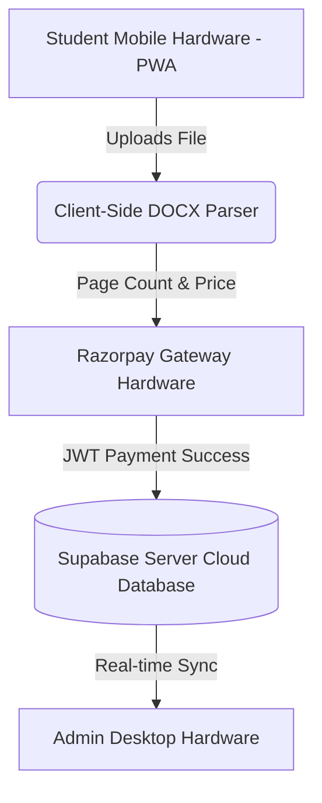
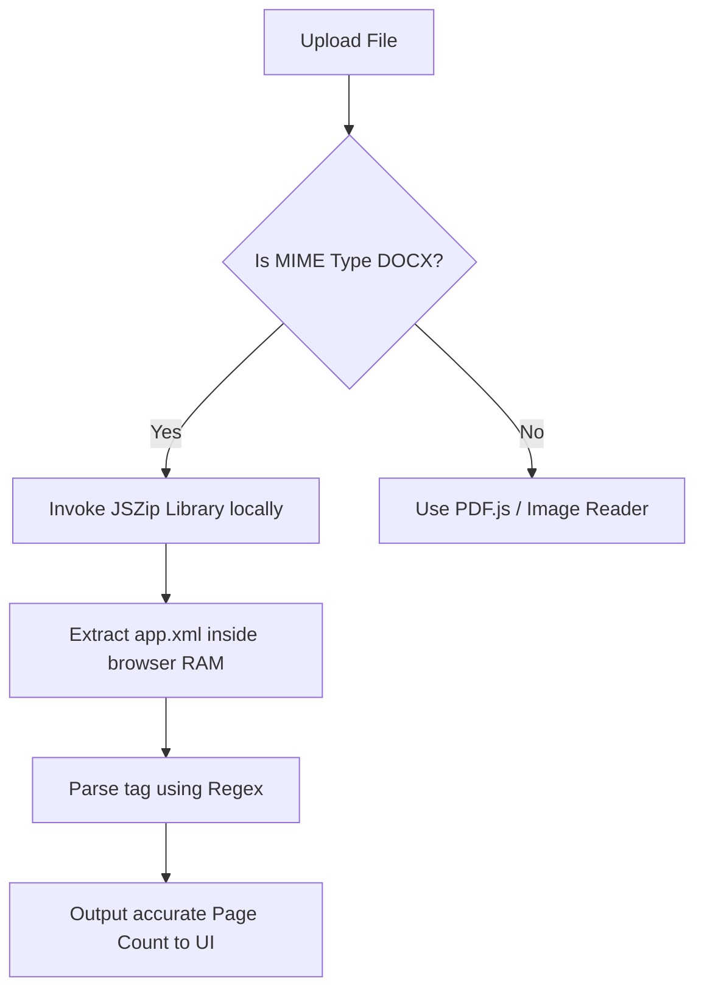
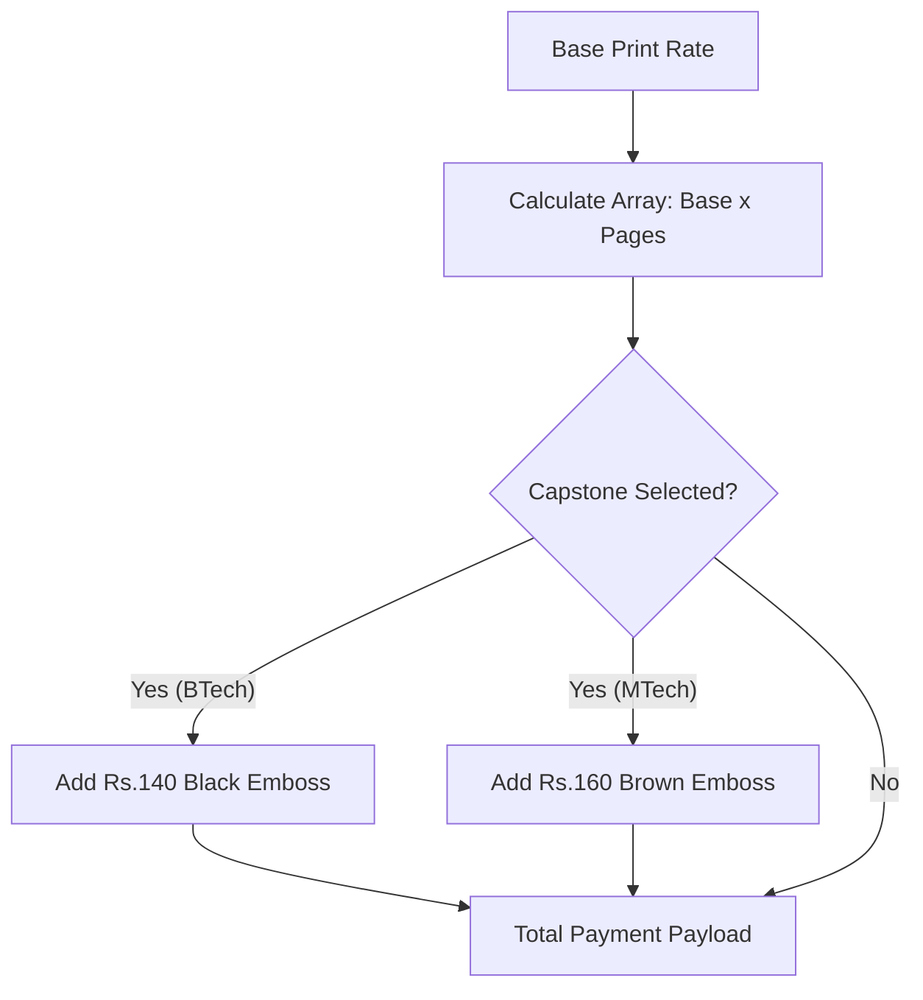

# COMPLETE PATENT APPLICATION / INVENTION DISCLOSURE FORM

**1. Title of the Invention**
"A System and Method for Client-Side Document Processing, Parametric Pricing, and Automated Print Queue Management via a Progressive Web Application."

---

**2. Field of the Invention**
The present invention relates broadly to the technical domains of Computer Science and Cloud-Based Utility Computing. More specifically, it pertains to Client-Side Document Processing Systems, Serverless Web Architectures, and Web-Based Automated Print Queue Management. The invention further encompasses the application of Progressive Web Applications (PWA) and Dynamic Parametric Financial Computing software combined with hardware to facilitate secure, zero-installation academic document submission and commercial print routing.

---

**3. Background of the Invention (Problem Statement)**
Current physical document reproduction infrastructures and university print shops are crippled by severe technical bottlenecks:
*   **Manual File Transfers:** Environments rely heavily on unsecure physical USB flash drives or unorganized messaging protocols (e.g., WhatsApp) to transfer files, creating network vulnerabilities and delays.
*   **Lack of Native File Analysis:** There is no existing method to automatically and natively ascertain the page count of proprietary binary files (like .docx) without invoking paid external APIs.
*   **Absence of Remote Submissions:** Placed out-station students have no centralized, official remote gateway to digitally submit large capstone project reports to faculty.
*   **High Human Error:** Human-calculated pricing models and verbal configuration instructions lead to frequent misprints, physical queue build-ups (often extending to 90 minutes), and revenue loss.

---

**4. Prior Art (Existing Solutions & Their Limitations)**
Current digital solutions in the document processing market fail to address the needs of high-volume, rapid-turnaround campus environments due to inherent software limitations:
*   **CloudConvert & Paid APIs:** Existing document estimation tools require developers to pay per-API-call, operating by uploading the user's secure document to a third-party server, increasing network latency and privacy risks.
*   **Server-Side MS Word Rendering:** Alternate solutions require expensive Windows Server instances hosting Microsoft Office to parse files, significantly increasing hardware costs overhead. 
*   **App Store Limitations:** Traditional systems require downloading a heavy native application via an App Store. Existing web-based portal alternatives completely lack offline connectivity and push notifications.
The present invention overcomes these limitations by operating entirely within the native web browser's memory, proving substantial technical novelty.

---

**5. Object of the Invention**
The primary objects of the present invention are to provide a system that:
*   **Eliminates physical queues:** By completely digitizing the document upload, configuration, and payment cycle.
*   **Provides accurate automated page counting:** By securely calculating file lengths locally without server dependency.
*   **Enables remote document submission:** Providing a formal gateway for out-station students to submit verified files.
*   **Integrates dynamic payments:** Fusing the print workflows with live Razorpay gateway hardware to ensure end-to-end transaction safety.

---

**6. Summary of the Invention**
The present invention proposes a complete, hardware-and-software integrated, serverless web ecosystem. The infrastructure connects a **browser-based client hardware device** (a student's smartphone or PC) to an administrative terminal via **cloud server infrastructure deployed on Supabase (PostgreSQL databases and secure buckets)**. 

The software logic orchestrates the data flow: the student's hardware performs the cryptographic and unzipping logic required to parse document parameters, passes local state variables to a dynamic pricing engine, securely handles payment through Razorpay processing terminals, and injects the resulting metadata into the cloud server. A secondary administrative portal retrieves this data, utilizing custom Blob-routing to ensure safe file downloads specific to the file's MIME type.

---

**7. Detailed Description of the Invention**

**A. Client-Side DOCX Parsing Module**
The pinnacle of the system's novelty is the bypass of third-party execution for Microsoft Word documents. When a student uploads a `.docx` file, the JavaScript execution thread invokes the `JSZip` library locally. It unzips the Open XML binary container in the browser's RAM, traverses the file tree to intercept the `app.xml` and `core.xml` files, and extracts `<Pages>` XML data parameters. This yields exact page lengths with zero server-side processing, saving bandwidth and API costs.

**B. Dynamic Pricing Engine**
Integrated into the submission UI is a live React-based rule calculator. It intercepts the parsed page length and multiplies it by database-configured parameters. It incorporates distinct parametric rules: for example, degree detection applies conditional logic (B.Tech triggers a Black embossing fee rule of ₹140, whereas M.Tech triggers a Brown embossing fee rule of ₹160), altering the payment token immediately.

**C. PWA Offline Functionality**
The application employs Service Workers to securely cache web app manifests, CSS, and API responses. If a student loses their internet connection inside the print shop, the caching mechanism ensures the PWA still natively loads the DOM and their uniquely generated QR Code, allowing them to verify their order with the shopkeeper without active bandwidth.

**D. Intelligent File Routing System**
To protect the administrative portal from browser thread-lockups, the system analyzes the MIME type of incoming files upon the click of the "Download" button. Safe visualization files (PDFs, Images) are intercepted and opened via `target="_blank"` browser routing. Binary files (Word documents) bypass visual rendering entirely; the software forces an `a.download` memory Blob dump, pushing the file directly to the shopkeeper’s hardware download folder for immediate printing.

**E. Remote Submission Gateway**
A dedicated logic partition allows students to submit metadata (Roll No., Department, Guide Name, Project Title) bound securely to a file payload. The system generates a two-way "Notice Subsystem", where administrators can change the SQL row status (Approved/Rejected) which pushes live status notifications back to the student portal.

---

**8. Claims**

1. **A computer-implemented system for document processing comprising:** a client-side browser module configured to intercept binary Open XML (e.g., .docx) files, utilizing local ZIP extraction algorithms to unarchive XML metadata, and applying node-parsing to estimate precise document page counts entirely within client hardware memory, without transmission to server-side processors or third-party APIs.
2. **The system of Claim 1,** further characterizing a Progressive Web Application (PWA) architecture utilizing Service Workers to cache user-generated transaction data and Quick Response (QR) codes for visual offline authentication.
3. **An automated parametric pricing engine** that retrieves integer data generated by Claim 1, compounding it against localized conditional string arrays (including but not limited to degree classification and embossing color mappings), to instantly generate an encrypted financial payload.
4. **The method of Claim 3,** implemented in tandem with integration into third-party cryptographic payment gateway hardware to ensure transaction completion before database injection.
5. **A decoupled file-routing execution protocol** that analyzes the MIME type of intercepted administrative downloads, programmatically routing safe execution streams to new browser tabs, whilst compelling binary files to generate automatic hardware-level Blob downloads to prevent interface thread-locking.

---

**9. Abstract**
The present invention relates to an integrated PWA software and hardware system designed to modernize and automate college print shop operations and remote document submissions. Addressing the core issues of manual USB transfers, long queue times, and unorganized reporting, the system introduces a totally serverless, client-side document processing engine. Utilizing purely client-browser hardware, the software executes ZIP decompression and XML analysis on proprietary `.docx` files to output instant page estimations without expensive server processing. This data is fed into a dynamic pricing algorithm tailored to institutional constraints (e.g., Capstone binding costs) and funneled through a live payment gateway. Administrative terminals receive optimized, queue-managed data utilizing intelligent Blob-routing to eliminate browser thread lockups during downloads. 

---

**10. Drawings / Figures**

*(Note: In an actual filing, these would be exported as images. Here we present the literal architectural flows defining the drawings via Mermaid diagram syntax)*

**Figure 1: System Architecture Diagram**

**Figure 2: Flowchart of DOCX Parsing Algorithm**

**Figure 3: Pricing Engine Logic**

---

**11. Hardware-Software Integration Statement**
The invention operates on a combination of client hardware (the user's mobile device or desktop PC computing RAM/CPU), high-availability cloud server infrastructure (Supabase PostgreSQL hardware clusters), and payment processing hardware (Razorpay financial gateway terminals). These physical hardware endpoints are seamlessly integrated with, and absolutely necessary for the execution of, the software modules, React logic, and database schemas described herein.

---

**12. Technical Advantages Over Prior Art**
1.  **Zero server-side dependency** for document page calculations, reducing hardware compute costs to negligible amounts.
2.  **Offline PWA functionality** via service workers securely caches data preventing queue-locking when mobile networks fail.
3.  **Real-time queue management** utilizing PostgreSQL row-level subscription sync, eliminating manual browser polling.
4.  **Automated dynamic pricing** completely eliminating human error and manual price bargaining at physical locations.
5.  **Intelligent dual-role architecture** with bespoke MIME-type routing that prevents browser crashes during massive batch print downloads.

---

**13. Industrial Applicability Statement**
The system logic and architectural framework described herein possess massive industrial applicability. While initially configured for university settings, the invention can be rapidly scaled and deployed across massive geographic infrastructures, including private commercial print chains, government documentation centers, bulk litigation filing hubs, and architectural firm plotter networks, resulting in millions of labor-hours saved and vastly improved infrastructural security.
